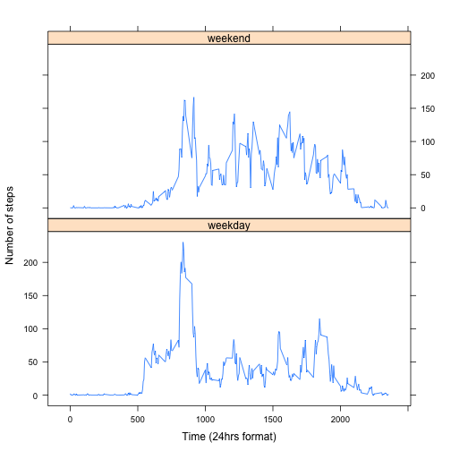

Reproducible Research: Peer Assessment 1
=======================================
Written by Junyan Tan, 17/05/2014

Setting global options, setting all R code to be echoed and output to be cached.

```r
opts_chunk$set(echo = TRUE, cache = TRUE)
```


## Loading and preprocessing the data

Setting the correct working directory, reading and processing data


```r
setwd("~/Desktop/test_repo/RepData_PeerAssessment1")
data <- read.csv("activity.csv", header = TRUE)
str(data)  # generate summary
```

```
## 'data.frame':	17568 obs. of  3 variables:
##  $ steps   : int  NA NA NA NA NA NA NA NA NA NA ...
##  $ date    : Factor w/ 61 levels "2012-10-01","2012-10-02",..: 1 1 1 1 1 1 1 1 1 1 ...
##  $ interval: int  0 5 10 15 20 25 30 35 40 45 ...
```


## What is mean total number of steps taken per day?

The code below makes a histogram of the total number of steps taken each day as well as calculates and reports the mean and median total number of steps taken per day


```r
dailysteps <- tapply(data$steps, data$date, sum, na.rm = TRUE)
hist(dailysteps, main = "Histogram of total number of steps taken per day", 
    xlab = "Total number of steps taken per day")
```

 

```r
mean(dailysteps)
```

```
## [1] 9354
```

```r
median(dailysteps)
```

```
## [1] 10395
```


The mean total number of steps taken per day is 9354.2295 and the median total number of steps taken per day is 10395.

## What is the average daily activity pattern?

Giving a time series plot of the 5-minute interval (x-axis) and the average number of steps taken, averaged across all days (y-axis)


```r
avesteps <- tapply(data$steps, data$interval, mean, na.rm = T)
plot(names(avesteps), avesteps, type = "l")
```

 

```r
ans <- names(avesteps[which.max(avesteps)])
```


The 5-minute interval, on average across all the days in the dataset, which contains the maximum number of steps is 835.

## Imputing missing values

The code below calculate and reports the total number of missing values in the dataset (i.e. the total number of rows with NAs). Then it creates a new dataset which replaces the missing values with the number of steps for that 5 min interval averaged across all days. 


```r
nrna <- sum(is.na(data$steps))
filleddata <- data
for (x in 1:length(filleddata$steps)) {
    if (is.na(filleddata$steps[x])) {
        filleddata$steps[x] <- avesteps[names(avesteps) == filleddata$interval[x]]
    }
}
filleddailysteps <- tapply(filleddata$steps, filleddata$date, sum, na.rm = TRUE)
```


The total number of missing rows in the original dataset is 2304.

Plotting a histogram of the total number of steps taken each day with the processed dataset (filled in NA rows).


```r
hist(filleddailysteps, main = "Histogram of total number of steps taken per day", 
    xlab = "Total number of steps taken per day")
```

 

```r
mean(filleddailysteps)
```

```
## [1] 10766
```

```r
median(filleddailysteps)
```

```
## [1] 10766
```


So for the processed dataset, the mean total number of steps taken per day is 1.0766 &times; 10<sup>4</sup> and the median total number of steps taken per day is 1.0766 &times; 10<sup>4</sup>. From part 1 of the assignment, the mean total number of steps taken per day is 9354.2295 and the median total number of steps taken per day is 10395. The mean and median for the processed dataset is higher than that of the original dataset because replaced values are generally greater than 0 so it would shift estimates of the total daily number of steps up compared to estimates from the original dataset.

## Are there differences in activity patterns between weekdays and weekends?

The code below creates a new factor variable (weekvar) in the dataset with two levels – “weekday” and “weekend” indicating whether a given date is a weekday or weekend day and makes a panel plot containing a time series plot (i.e. type = "l") of the 5-minute interval (x-axis) and the average number of steps taken, averaged across all weekday days or weekend days (y-axis).


```r
library(chron)
library(lattice)
filleddata$weekvar <- is.weekend(strptime(filleddata$date, "%Y-%m-%d"))
filleddata$weekvar[filleddata$weekvar == TRUE] <- "weekend"
filleddata$weekvar[filleddata$weekvar == FALSE] <- "weekday"
filleddata$weekvar <- as.factor(filleddata$weekvar)
filleddata$interval <- as.factor(filleddata$interval)
newdat <- aggregate(steps ~ weekvar + interval, data = filleddata, mean)
newdat$interval <- as.numeric(as.character(newdat$interval))
xyplot(steps ~ interval | weekvar, data = newdat, type = "l", layout = c(1, 
    2), ylab = "Number of steps", xlab = "Time (24hrs format)")
```

 

